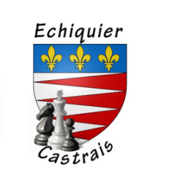

# Echiquier Castrais
 
Fondé en 1931, ce club fête cette année ses 90 ans !
Un nonagénaire en pleine forme...
# Infos du club
<a href="https://fr-fr.facebook.com/echiquier.castrais/">Page Facebook du club</a> 
<a href="http://www.echecs.asso.fr/FicheClub.aspx?Ref=1233">Et sur le site FFE</a> 

<!--
    ceci est un commentaire non affiché !
-->
# Actualité de CASTRES
<b><u>09/03/2021</b></u> 
<b>Léa sur les traces de son Papa...Et de son frère !</b> 
Eric CASSAM-CHENAI, joueur du club, peut être fier de sa fille Léa qui vient de remporter le titre de championne en départemental chez les petites poussines...
Et cela s'est passé dans le département 93 (Seine St Denis). En effet, Léa, comme son frère Antoine, est licenciée dans le club de Tremblay-En-France (93).
Dans ce département, le championnat a pu se dérouler en présentiel, au Blanc Mesnil les 6 et 7 Mars derniers.
<b>Bravo Léa !</b> 
 

<b><u>16/02/2021</b></u> 
Dans le cadre des stages OMEPS qui se déroulent pendant les vacances scolaires de février et de printemps, l'échiquier Castrais est intervenu ce mardi 16 février après-midi pour initier des jeunes à notre jeu d'échecs. Cette intervention s'est déroulée en extérieur dans le parc de Gourgade et sous le soleil ! 
Un grand MERCI à <b>Sabine, Marie-France, Mattéo et Mathieu</b> qui ont encadré les jeunes pousses !  

<b><u>20/01/2021</b></u> 
En raison de la pandémie nous ne pouvons avoir accès à la salle Louisa Paulin pour nos entrainements.
Les cours continueront donc à se faire en ligne. 
Pour info : <a href="http://www.echecs.asso.fr/Actu.aspx?Ref=12132"><b>MASTERCLASS FFE</b> vendredi 22 janvier à 19h00</a>

<b><u>18/01/2021</b></u> 
Un article de presse sur le club et la pratique des échecs en ligne a été diffusé samedi dernier dans le journal la dépêche. 
Pour télécharger l'article, c'est <a href="../ArticlePresse_16_01-2021.pdf">ICI</a>

<b><u>12/01/2021</b></u> 
A compter du mercredi 20 janvier les cours d'échecs jeunes de l'échiquier castrais seront accessibles pour les jeunes des autres clubs du département qui le souhaitent.

