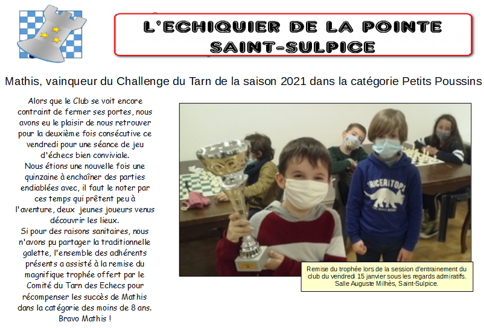

# Club d'Echecs de Saint Sulpice

Le Club d'échecs de Saint-Sulpice a commencé ses activités en 2017, lancé par Patrice VINCENS, Président du Comité du Tarn. 

En 2018, l'association adhère à la Fédération Française d'Echecs. Depuis, le club se développe grâce à la bonne volonté et à la générosité de ses bénévoles qui s'investissent au gré de leur passion pour le jeu des Rois, le tout dans une ambiance conviviale et le respect de chacun.

Pour la compétition ou seulement le plaisir, pour apprendre, progresser ou juste passer un bon moment, quelque soit l'âge ou le niveau, vous êtes toutes et tous les bienvenus à l'échiquier de La Pointe.

# Infos du club

OUVERTURE HEBDOMADAIRE DU CLUB

Mardi : de 17h30 à 20h00. Tous publics

Vendredi : 	de 17h00 à 18h15 à Session «Jeunes et débutants»
		de 18h30 à 20h00 à Session joueurs confirmés.

Les entraînements se déroulent dans la salle du CITEL, 416 rue du Capitaine Beaumont, 81370 Saint-Sulpice-la-pointe

CONTACTS : 

	<a> 06 18 51 06 65 (Frédéric)</a>	
	<a href="mailto:echecs81380@gmail.com"> Contact par email</a> 
	<a href="http://echiquierdelapointe-saintsulpice.fr/index.php">Site officiel du Club</a> 
	<a href="http://www.echecs.asso.fr/FicheClub.aspx?Ref=3077">Sur le site FFE</a> 

# Actualité de Saint-Sulpice
<b><u>17/01/2021</b></u> 

